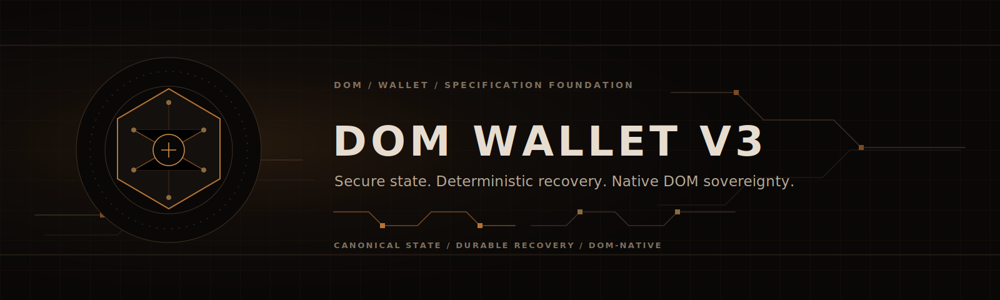

<p align="center">
  
</p>

<p align="center">
  
  
  
  
</p>

# DOM Wallet V3

> A secure, recoverable, and DOM-native wallet architecture.

> **Current phase: Foundation and Specification.** All foundational specifications have completed their first design pass; eight are in **REVIEW** and five remain **DRAFT**. No functional wallet exists yet. Implementation and launch are authorized under the open community-review policy, while the project remains experimental and unaudited until evidence changes.

DOM Wallet V3 is a new, independent wallet architecture for the DOM protocol. It is being specified before implementation so that wallet correctness includes failure, recovery, and adversarial behavior—not only a successful transaction path.

V3 preserves validated DOM Wallet V1 and V2 properties while establishing one DOM-native model for state, persistence, synchronization, recovery, and verification. It is neither a port nor a fork of another wallet project, and it is not a cosmetic refactor of DOM Wallet V2.

The repository is intentionally not a functional wallet yet. Its present deliverable is an engineering foundation that can be reviewed before wallet crates, network operations, seed handling, or user-facing payment flows are introduced.

## Why V3 Exists

A wallet can appear correct on a happy path and still be unsafe when a write stops halfway, a node becomes unavailable, a request is replayed, or two callers reserve the same output. Wallet correctness must survive the operational conditions users actually encounter.

V3 is being designed to account for partial writes, node outage, replay, concurrent reservations, stale chain state, and a same-height reorganization. It also treats backup corruption, incomplete restore, migration risk, and exact transaction resubmission as first-class engineering problems.

The goal is a wallet whose state remains explainable and recoverable after interruption. That requires explicit invariants, durable intent before external effects, deterministic reconciliation, and verification that includes hostile or incomplete inputs.

## DOM Sovereignty

DOM Wallet V3 follows only:

* DOM consensus.
* DOM cryptographic primitives.
* DOM chain ID.
* DOM transaction and slate formats.
* DOM fees and weights.
* DOM coinbase and maturity rules.
* DOM privacy requirements.
* DOM backup and recovery contracts.

**DOM semantics > Epic strategy.**

DOM Wallet V1 and V2 are sources of DOM-specific experience and validated properties. A comparative wallet study may inform protected properties, architectural boundaries, failure handling, recovery methods, and test categories; it does not define protocol behavior, data formats, economics, cryptography, transport, or compatibility for DOM Wallet V3.

## Current Project Status

The repository foundation and engineering baseline are complete. The first design pass, adversarial cross-review, and blocker-closure work are complete through the owner-approved StableView policy. DEC-STABLE-VIEW is resolved through a limited ChainSource wallet policy strengthened by DOM height-and-hash binding and fail-closed validation. The project owner has selected Option A — Hardened DOM Wallet Continuity for DEC-V3-SECRET-DOMAINS. There are 30 effective RESOLVED decisions, 0 effective BLOCKING decisions, and 0 effective HIGH blockers. Eight foundational specifications are in REVIEW and five remain DRAFT as incomplete engineering documents.

No wallet crates or functional wallet implementation exist in this repository. Implementation, private testnet, public testnet, and mainnet launch are not conditioned on an external audit or independent review. The project follows open community review; external audits are welcome but optional. Market value is external to protocol enforcement, and the software has no audit-status or asset-value runtime classification. Incomplete security work remains publicly tracked; this is not an audit, safety, or risk-free claim.

| Specification | Status |
|---|---|
| 0000 Design Principles | REVIEW |
| 0001 Threat Model | REVIEW |
| 0002 Wallet State Model | REVIEW |
| 0003 Transaction Lifecycle | DRAFT |
| 0004 Storage Atomicity | REVIEW |
| 0005 Chain Source and Sync | REVIEW |
| 0006 Reorg and Rollback | REVIEW |
| 0007 Key Derivation and Secrets | DRAFT |
| 0008 Backup and Recovery | DRAFT |
| 0009 Economic Rules | REVIEW |
| 0010 API and Transport Security | DRAFT |
| 0011 Migration from V2 | DRAFT |
| 0012 Testing and Assurance | REVIEW |

The authoritative status table is maintained in [Specifications](specs/README.md). The owner-approved [Mainnet and Community Review Policy](docs/MAINNET_AND_COMMUNITY_REVIEW_POLICY.md) records the launch model and continuing security obligations. The review evidence is recorded in the [Consistency Matrix](docs/SPECIFICATION_CONSISTENCY_MATRIX.md), [Decision Register](docs/FOUNDATIONAL_DECISION_REGISTER.md), [Cryptographic review request](docs/FOUNDATIONAL_CRYPTOGRAPHIC_REVIEW_REQUEST.md), [Secret-domain design options](docs/FOUNDATIONAL_SECRET_DOMAIN_DESIGN_OPTIONS.md), [StableView approval report](reports/FOUNDATIONAL_STABLE_VIEW_APPROVAL.md), [Cross Review Report](reports/FOUNDATIONAL_SPECIFICATIONS_CROSS_REVIEW.md), and [Community Review Policy Update](reports/MAINNET_AND_COMMUNITY_REVIEW_POLICY_UPDATE.md).

## Core Design Principles

* **One canonical wallet state.** Identity, accounts, outputs, reservations, transaction records, private contexts, cursor, and recovery evidence share one versioned model.
* **Explicit state machines.** Valid and invalid transitions are part of the design, not implied by UI flow or database fields.
* **Atomic durable operations.** A logical action commits as one durable unit of work or remains recoverable as the previous generation.
* **Crash recovery by design.** Every persistent operation has defined reopen and restart behavior.
* **Idempotent replay.** Retried requests, scans, restores, and recovery plans cannot create duplicate logical actions.
* **Height-and-hash chain identity.** A canonical cursor identifies a height and its block hash; a height alone is insufficient.
* **Reorganization as normal behavior.** Removed receives, spends, maturity, cursor movement, and local intent are reconciled deliberately.
* **No silent secret reuse.** Allocation and transaction-secret evidence must survive restart, restore, and migration.
* **Recovery as an architectural requirement.** Backup, full recovery, seed-only limits, and interrupted recovery are designed before implementation.
* **Least privilege.** Unlock, spending, receiving, backup, administration, and observation have separate capability boundaries.
* **Deterministic testability.** Time, randomness, source behavior, storage faults, crashes, and reorganizations must be controllable in tests.

## Confirmed V3 Requirement: DOM-W2-SYNC-001

`DOM-W2-SYNC-001` is a confirmed V3 design requirement. Height alone is insufficient to decide whether a wallet is current. The canonical cursor includes both `height` and `block_hash`.

* A same-height reorganization forces reconciliation.
* A lower-height canonical view forces reconciliation.
* A missing, changed, or unverifiable hash forces reconciliation.
* The cursor and every corresponding wallet-state change commit atomically.

This rule prevents a height-only shortcut from presenting an outdated canonical view as current. The detailed contract is in [Chain Source and Sync](specs/0005_CHAIN_SOURCE_AND_SYNC.md) and [Reorg and Rollback](specs/0006_REORG_AND_ROLLBACK.md).

## Target Architecture

```text
User interfaces and automation
            ↓
      Capability APIs
            ↓
Lifecycle, synchronization, and recovery
            ↓
      Canonical domain model
            ↓
Crypto, storage, ChainSource, and transport ports
            ↓
       DOM Protocol adapters
```

Dependencies point inward. User interfaces, automation, concrete storage, nodes, and transports adapt to domain contracts; the canonical domain model does not depend on a CLI, UI, HTTP service, or a concrete node implementation. DOM protocol adapters provide the selected consensus and cryptographic behavior at the boundary without allowing external infrastructure to redefine wallet rules.

## Planned Workspace

The following crates are planned, but none has been introduced. A crate may be added only after its governing specifications are accepted.

| Planned crate | Intended responsibility |
|---|---|
| `dom-wallet-domain` | Canonical state, invariants, and domain transitions. |
| `dom-wallet-crypto` | DOM-native wallet cryptographic boundaries. |
| `dom-wallet-storage` | Encrypted durable units of work and recovery. |
| `dom-wallet-chain-source` | Transport-independent canonical-chain evidence. |
| `dom-wallet-sync` | Initial, incremental, and full reconciliation. |
| `dom-wallet-reorg` | Evidence-based rollback and replay. |
| `dom-wallet-lifecycle` | Send, receive, finalize, submit, and cancellation contracts. |
| `dom-wallet-backup` | Backup and recovery orchestration. |
| `dom-wallet-node` | DOM Protocol node adapters. |
| `dom-wallet-api` | Capability-oriented interfaces. |
| `dom-wallet-cli` | Command-line interaction and diagnostics. |
| `dom-wallet-testkit` | Deterministic test controls and integration support. |

## Target Capabilities

When implementation is introduced, the architecture is intended to support:

* wallet lifecycle and account management;
* outputs and derived balance views;
* send and receive lifecycle handling;
* canonical synchronization and reconciliation;
* reorganization detection, rollback, and replay;
* chain-bound backup;
* seed-only recovery with explicitly limited guarantees;
* full-backup recovery;
* DOM Wallet V2 migration;
* capability-oriented APIs;
* CLI workflows and redacted diagnostics.

This list is a design target, not a statement of currently available functionality.

## Security Model

The security model protects critical secrets, integrity-critical wallet state, availability-critical recovery state, and privacy assets such as output ownership, balances, transaction links, derivation positions, and source-query metadata. It considers remote callers, narrower-capability callers, malicious or stale sources, replaying peers, concurrent local processes, storage corruption or rollback, backup theft, and resource exhaustion.

The design requires chain binding, authenticated encrypted state, non-reuse evidence, least privilege, bounded source work, redacted diagnostics, and fail-closed recovery where evidence is incomplete. Authentication of a source does not itself prove the validity of its data.

See the [Threat Model](specs/0001_THREAT_MODEL.md), [Wallet State Model](specs/0002_WALLET_STATE_MODEL.md), and [Storage and Atomicity](specs/0004_STORAGE_ATOMICITY.md).

## Verification Strategy

V3 verification is planned as a layered program rather than a single happy-path test suite:

* unit tests for transitions, boundaries, and invalid inputs;
* property tests for state invariants, allocation non-reuse, idempotency, and reconciliation equivalence;
* an executable state model used to compare implementation behavior with the specified model;
* restart tests for every durable operation and recovery phase;
* reorganization tests, including same-height and lower-height cases;
* concurrency tests for expected-generation conflicts and reservation uniqueness;
* corruption and truncation tests for persisted and backup data;
* fuzzing of framing, canonical records, source replies, and recovery plans;
* integration tests for storage, source switching, restore, and lifecycle boundaries;
* multi-node and multi-wallet end-to-end tests after implementation exists.

The required test categories for the completed specifications are recorded in the corresponding specification documents.

## Implementation Gates

| Gate | Status | Evidence |
|---|---|---|
| Gate 0 — Foundation baseline | COMPLETE | Engineering baseline and repository foundation are recorded. |
| Gate 1 — Foundational specifications | IN PROGRESS | First passes, cross-review, StableView closure, and Option A policy selection are complete. Five DRAFT specifications remain an engineering-completion tracker; Gate 1 is not a runtime, implementation, testnet, mainnet, mining, transaction, or fund-usage prohibition. |
| Gate 2 — State-model acceptance | NOT STARTED | Requires accepted governing specifications. |
| Gate 3 — Storage and crash-recovery acceptance | NOT STARTED | Requires accepted persistence and recovery design. |
| Gate 4 — Chain-source and sync acceptance | NOT STARTED | Requires accepted canonical-view contract. |
| Gate 5 — Reorg and rollback acceptance | NOT STARTED | Requires accepted rollback and convergence design. |
| Gate 6 — Secrets and backup acceptance | NOT STARTED | Requires accepted secret and recovery specifications. |
| Gate 7 — Economics and lifecycle acceptance | NOT STARTED | Requires accepted DOM economics and lifecycle specifications. |
| Gate 8 — Interface and transport acceptance | NOT STARTED | Requires accepted capability and transport specifications. |
| Gate 9 — Migration acceptance | NOT STARTED | Requires accepted DOM Wallet V2 migration specification. |
| Gate 10 — Implementation introduction | AUTHORIZED | Implementation is authorized under the owner policy; versioned constructions, vectors, tests, migrations, and fail-closed behavior remain engineering deliverables. |
| Gate 11 — Verification completion | NOT STARTED | Requires implementation and required test evidence. |
| Gate 12 — Community and optional external review | CONTINUOUS | Community findings and optional external reviews are welcome evidence; they are not implementation, release, runtime, testnet, mainnet, mining, transaction, or fund-usage gates. |
| Gate 13 — Operational evidence tracking | CONTINUOUS | Tracks disclosed risks, compatible security upgrades, and operational evidence. It is not an audit-status or asset-value enforcement mechanism. |

## Specifications and Documentation

* [Specification index](specs/README.md)
* [Architecture foundation](docs/ARCHITECTURE.md)
* [Engineering sources](docs/ENGINEERING_SOURCES.md)
* [Reference baseline](docs/REFERENCE_BASELINE.md)
* [Adoption matrix](docs/EPIC_DOM_ADOPTION_MATRIX.md)
* [Confirmed design inputs](docs/CONFIRMED_DESIGN_INPUTS.md)
* [Specification gate](docs/SPECIFICATION_GATE.md)
* [Foundational specifications pass 1](reports/FOUNDATIONAL_SPECIFICATIONS_PASS1.md)
* [Foundational specifications pass 2](reports/FOUNDATIONAL_SPECIFICATIONS_PASS2.md)
* [Specification consistency matrix](docs/SPECIFICATION_CONSISTENCY_MATRIX.md)
* [Foundational decision register](docs/FOUNDATIONAL_DECISION_REGISTER.md)
* [Mainnet and community review policy](docs/MAINNET_AND_COMMUNITY_REVIEW_POLICY.md)
* [Mainnet and community review policy update](reports/MAINNET_AND_COMMUNITY_REVIEW_POLICY_UPDATE.md)
* [Foundational cross review](reports/FOUNDATIONAL_SPECIFICATIONS_CROSS_REVIEW.md)
* [Foundational blocker closure pass 1](reports/FOUNDATIONAL_BLOCKER_CLOSURE_PASS1.md)
* [Foundational blocker status reconciliation](reports/FOUNDATIONAL_BLOCKER_STATUS_RECONCILIATION.md)

## Engineering References

DOM Wallet V1 and V2 provide DOM-specific experience, validated behavior, chain-ID protections, backup mechanisms, transaction-format knowledge, and known failure cases. Existing DOM components are retained only after validation for V3.

Epic Wallet contributes protected properties and engineering lessons concerning architecture, failure handling, recovery, and verification categories. No Epic implementation is copied, and no Epic protocol behavior becomes authoritative for DOM.

The source hierarchy and adoption constraints are documented in [Engineering Sources](docs/ENGINEERING_SOURCES.md), [Reference Baseline](docs/REFERENCE_BASELINE.md), and the [Adoption Matrix](docs/EPIC_DOM_ADOPTION_MATRIX.md).

## Building

No functional wallet implementation exists yet. The current workspace is a specification foundation and declares no member crates, so there is no wallet binary, library, or test suite to run.

The currently valid repository manifest check is:

```bash
cargo metadata --no-deps
```

`cargo metadata --no-deps` verifies the declared workspace manifest. The workspace has no Rust targets yet, so `cargo fmt --check` currently reports that it cannot find targets. The command is retained below as the formatting check that will become applicable when Rust source is introduced; it is not evidence of a built wallet or executed wallet tests.

```bash
cargo fmt --check
```

## Contributing

Contributions follow a specification-first process: identify the governing specification, preserve DOM sovereignty, make invariants and failure behavior explicit, and define reproducible verification before implementation work begins.

Read [CONTRIBUTING.md](CONTRIBUTING.md) before proposing or making changes.

## Authorship

Soren Planck <sorenplanck@tutamail.com>

Commit trailers naming a second author and automated-tool attribution are prohibited.

## License

No license has been selected yet. No reuse rights are implied until a LICENSE file exists.

<p align="center">
  <strong>DOM Wallet V3</strong><br>
  Secure state. Deterministic recovery. Native DOM sovereignty.
</p>
